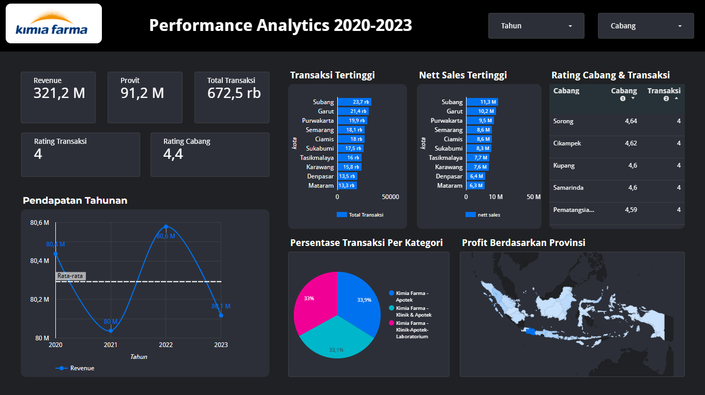
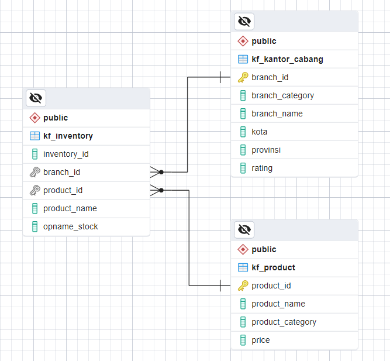

# **Internship Experience: Big Data Analytics - Kimia Farma**


🔗 **[View Full Dashboard](https://lookerstudio.google.com/reporting/e601dbf1-fd78-48ea-bfc8-ebb502328656)**  
---

# 🚀 Big Data Analytics Internship

This repository contains my work during my **Big Data Analytics Internship**, focusing on **data processing, analysis, and visualization** using **Google Looker Studio, BigQuery, and PostgreSQL**.

## 🔍 Key Focus Areas  
- ✅ **Data Collection & Processing** – Extracting and transforming data using **BigQuery & PostgreSQL**.  
- ✅ **Data Analysis** – Writing SQL queries for aggregations and insights.  
- ✅ **Data Visualization** – Designing interactive dashboards in **Looker Studio**.  

## 🛠 Tech Stack  
| Tool             | Description |
|-----------------|-------------|
| **BigQuery**    | Cloud-based data warehousing and analytics. |
| **PostgreSQL**  | Relational database for structured data storage. |
| **Looker Studio** | Dashboarding and data visualization tool. |

## 🎯 Project Goals  
📌 **Analyze large datasets** efficiently using **SQL & BigQuery**.  
📌 **Create interactive dashboards** for business insights.  
📌 **Optimize database queries** for performance improvements.  

---

## 📂 Project Structure  
```shell
kimia-Farma-Big-Data-Analyst
├── datasets
│   ├── kf_final_transaction.csv
│   ├── kf_inventory.csv
│   ├── kf_kantor_cabang.csv
│   └── kf_product.csv
├── images
│   ├── dashboard.png
│   └── erd-relation.png
├── README.md
└── sql
    └── code.sql

```
### 📁 Folder & File Explanation  
- **`datasets/`** → Contains raw CSV files used for analysis.  
  - `kf_final_transaction.csv` → Transactional data for analysis.  
  - `kf_inventory.csv` → Inventory data for stock management.  
  - `kf_kantor_cabang.csv` → Branch office details.  
  - `kf_product.csv` → Product information, including pricing.  

- **`images/`** → Stores visual assets related to the project.  
  - `dashboard.png` → A preview of the Looker Studio dashboard.  
  - `erd-relation.png` → Entity-Relationship Diagram (ERD) for database structure.  

- **`sql/`** → Contains SQL scripts for querying and data transformation.  
  - `code.sql` → Main SQL file containing queries for BigQuery & PostgreSQL.  

- **`README.md`** → Documentation file explaining the project.  

## 📊 Data Model - ERD  
  

<details>
  <summary>📜 View SQL Code for ERD</summary>

```sql
-- Mengambil dan aggregate data

/*
  ft = kf_final_transaction
  i  = kf_inventory
  kc = kf_kantor_cabang
  p  = kf_product
*/
CREATE TABLE kf_dataset.kf_analyst AS
SELECT 
    ft.transaction_id,  -- ID unik untuk setiap transaksi
    ft.date,  -- Tanggal transaksi
    ft.branch_id,  -- ID cabang tempat transaksi dilakukan
    kc.branch_name,  -- Nama cabang
    kc.kota,  -- Kota cabang
    kc.provinsi,  -- Provinsi cabang
    kc.rating AS rating_cabang,  -- Rating cabang berdasarkan kepuasan pelanggan
    ft.customer_name,  -- Nama customer yang melakukan transaksi
    ft.product_id,  -- ID produk yang dibeli
    p.product_name,  -- Nama produk yang dibeli
    p.price AS actual_price,  -- Harga asli produk
    ft.discount_percentage,  -- Persentase diskon yang diberikan pada produk

    -- Menentukan persentase laba berdasarkan harga produk
    CASE 
        WHEN p.price <= 50000 THEN 0.10                        -- Harga ≤ 50.000          → Laba 10%
        WHEN p.price > 50000 AND p.price <= 100000 THEN 0.15   -- Harga 50.000 - 100.000  → Laba 15%
        WHEN p.price > 100000 AND p.price <= 300000 THEN 0.20  -- Harga 100.000 - 300.000 → Laba 20%
        WHEN p.price > 300000 AND p.price <= 500000 THEN 0.25  -- Harga 300.000 - 500.000 → Laba 25%
        ELSE 0.30                                              -- Harga > 500.000         → Laba 30%
    END AS persentase_gross_laba,

    -- Menghitung nett_sales (harga setelah diskon diterapkan)
    (p.price * (1 - ft.discount_percentage)) AS nett_sales,

    -- Menghitung nett_profit (keuntungan setelah diskon dan laba diterapkan)
    ((p.price * (1 - ft.discount_percentage)) * 
      CASE 
          WHEN p.price <= 50000 THEN 0.10
          WHEN p.price > 50000 AND p.price <= 100000 THEN 0.15
          WHEN p.price > 100000 AND p.price <= 300000 THEN 0.20
          WHEN p.price > 300000 AND p.price <= 500000 THEN 0.25
          ELSE 0.30
      END
    ) AS nett_profit,

    ft.rating AS rating_transaksi  -- Rating transaksi berdasarkan kepuasan pelanggan

-- Mengambil data dari tabel transaksi utama
FROM kf_dataset.kf_final_transaction AS ft

-- Menghubungkan dengan tabel kantor cabang berdasarkan branch_id
LEFT JOIN kf_dataset.kf_kantor_cabang AS kc 
    ON ft.branch_id = kc.branch_id

-- Menghubungkan dengan tabel produk berdasarkan product_id
LEFT JOIN kf_dataset.kf_product AS p 
    ON ft.product_id = p.product_id;
```
</details> 


## 📜 Acknowledgments  
- Thanks to **Kimia Farma**  for their guidance.  
- Data provided by **Kimia Farma's internal systems**.  